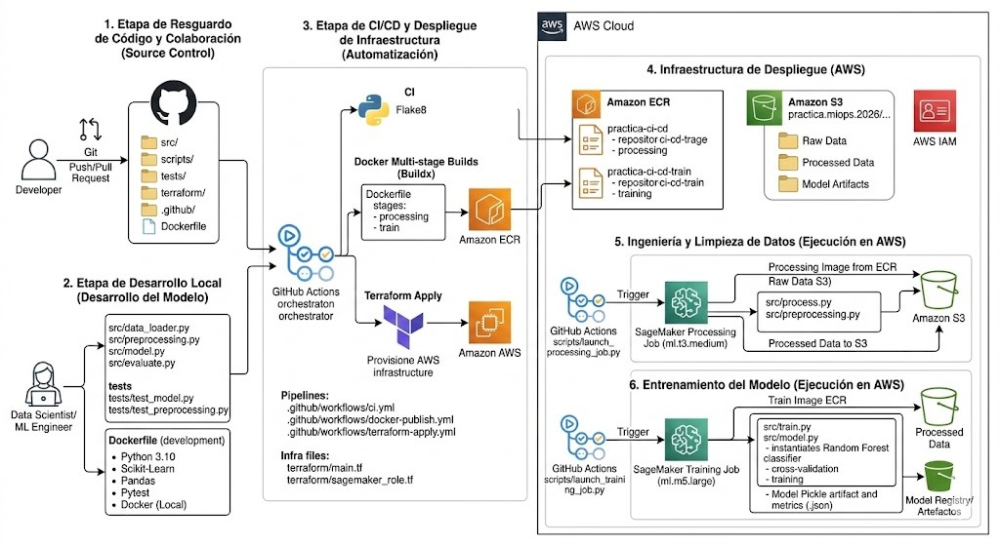

# Equipo 3

| Integrante | GitHub |
|---|---|
| **Alexis Nuñez** | [@AlexisNu-MLOPS](https://github.com/AlexisNu-MLOPS) |
| **Roberto Rivas** | — |

---

# 🚢 Proyecto Titanic ML — Pipeline MLOps End-to-End

[](https://www.python.org/)
[](https://scikit-learn.org/)
[](https://www.terraform.io/)
[](https://aws.amazon.com/ecr/)
[](https://aws.amazon.com/s3/)
[](https://aws.amazon.com/sagemaker/)
[](https://github.com/features/actions)

Proyecto completo de Machine Learning para predecir la supervivencia de pasajeros del Titanic, con un pipeline de MLOps que integra **Docker multi-stage**, **AWS ECR**, **AWS S3**, **SageMaker Processing & Training Jobs** e **Infraestructura como Código con Terraform**, todo orquestado por **GitHub Actions**.

> [!NOTE]
> **🎯 Proyecto académico — Práctica Final:** Este repositorio fue desarrollado como ejercicio práctico para demostrar habilidades de CI/CD, MLOps y mejores prácticas en proyectos de Machine Learning en la nube.

---

## 📑 Tabla de Contenidos

- [Arquitectura del Pipeline](#-arquitectura-del-pipeline)
- [Infraestructura con Terraform](#️-infraestructura-con-terraform)
- [Workflows de CI/CD](#-workflows-de-cicd)
- [Estructura del Proyecto](#-estructura-del-proyecto)
- [Inicio Rápido (Local)](#-inicio-rápido-local)
- [Modelos Soportados](#-modelos-soportados)
- [Resultados](#-resultados)
- [Testing](#-testing)
- [Tecnologías](#️-tecnologías)

---

## 🏗️ Arquitectura 


# Proyecto



# Pipeline

```
Push a main
    │
    ├─► ci.yml                          → flake8 + pytest (Python 3.10)
    │
    ├─► terraform-apply.yml             → Aprovisiona infraestructura AWS
    │       ├── ECR repos (processing + training)
    │       ├── S3 Bucket (practica.mlops.2026.ejemplo.studio)
    │       ├── IAM User (github-actions-ecr-practica-ci-cd)
    │       └── IAM Role (sagemaker-execution-practica-ci-cd)
    │
    └─► docker-publish.yml              (se activa luego de terraform-apply)
            │  Construye imagen processing  ──► ECR :processing-latest
            │  Construye imagen train       ──► ECR :train-latest
            │
            └─► sagemaker-pipeline.yml  (se activa luego de docker-publish)
                    │
                    ├─ Descarga dataset Titanic y lo sube a S3
                    ├─ Lanza SageMaker Processing Job
                    │      • Input:  s3://practica.mlops.2026.ejemplo.studio/
                    │      • Output: s3://practica.mlops.2026.ejemplo.studio/processed/
                    └─ Lanza SageMaker Training Job
                           • Input:  s3://practica.mlops.2026.ejemplo.studio/processed/
                           • Output: s3://practica.mlops.2026.ejemplo.studio/model/
```

---

## ☁️ Infraestructura con Terraform

Toda la infraestructura AWS se gestiona con Terraform en el directorio `terraform/`.

### Recursos creados

| Recurso | Nombre | Propósito |
|---|---|---|
| `aws_ecr_repository` | `practica-ci-cd` | Imágenes Docker (processing) |
| `aws_ecr_repository` | `practica-ci-cd-train` | Imágenes Docker (training) |
| `aws_ecr_lifecycle_policy` | — | Mantiene solo las últimas 10 imágenes |
| `aws_s3_bucket` | `practica.mlops.2026.ejemplo.studio` | Almacén de datos raw, procesados y modelos |
| `aws_s3_bucket_versioning` | — | Historial de versiones del bucket |
| `aws_iam_user` | `github-actions-ecr-practica-ci-cd` | Usuario de CI/CD para GitHub Actions |
| `aws_iam_user_policy` | `github-actions-policy` | Acceso a ECR y S3 |
| `aws_iam_role` | `sagemaker-execution-practica-ci-cd` | Rol asumido por SageMaker Jobs |
| `aws_iam_role_policy` | `sagemaker-s3-policy` | Acceso de SageMaker al bucket S3 |
| `aws_iam_role_policy` | `sagemaker-ecr-policy` | Pull de imágenes desde ECR |
| `aws_iam_role_policy_attachment` | `sagemaker_cloudwatch` | Logs de CloudWatch |

### Backend remoto

El estado de Terraform se almacena en un **S3 backend remoto** para persistencia entre ejecuciones de CI/CD.

### Idempotencia

El pipeline incluye lógica de `terraform import` para recursos existentes (ECR, S3, IAM User, IAM Role), por lo que puede ejecutarse múltiples veces sin generar errores de duplicado.

### Aplicar la infraestructura

```bash
cd terraform/
terraform init \
  -backend-config="bucket=<TU_BUCKET_ESTADO>" \
  -backend-config="key=terraform.tfstate" \
  -backend-config="region=us-east-1"

terraform apply   # Crea / actualiza recursos en AWS
terraform output  # Muestra URLs, ARNs y credenciales
```

> [!IMPORTANT]
> Después del primer `terraform apply`, configura los siguientes **Secrets** en GitHub → Settings → Secrets and variables → Actions:
> `AWS_ACCESS_KEY_ID`, `AWS_SECRET_ACCESS_KEY`, `AWS_SESSION_TOKEN`

---

## 🔄 Workflows de CI/CD

### 1. CI — Testing y Linting (`ci.yml`)

**Trigger:** Push o Pull Request a `main`

- Lint con `flake8`
- Tests con `pytest`

---

### 2. Terraform Deploy (`terraform-apply.yml`)

**Trigger:** Push a `main`

- Crea / actualiza el bucket de estado remoto S3
- Importa recursos AWS existentes (idempotente)
- Ejecuta `terraform plan` y `terraform apply`

**Jobs:** `terraform-plan` → `terraform-apply`

---

### 3. Docker Build and Publish (`docker-publish.yml`)

**Trigger:** Al completarse exitosamente `Terraform Deploy`

- Build imagen `processing` → `ECR :processing-latest`
- Build imagen `train` → `ECR :train-latest`
- (en tags `v*`) imagen `prod` → `ECR :prod-latest`

---

### 4. SageMaker Processing Pipeline (`sagemaker-pipeline.yml`)

**Trigger:** Al completarse exitosamente `Docker Build and Publish to ECR`

Pasos:
1. Descarga el dataset Titanic (`scripts/download_data.py`)
2. Sube los CSVs a S3 (`S3_INPUT`)
3. Lanza **SageMaker Processing Job** (imagen `processing-latest`)
4. Lanza **SageMaker Training Job** (imagen `train-latest`)

| Variable | Valor |
|---|---|
| `S3_INPUT` | `s3://practica.mlops.2026.ejemplo.studio/` |
| `S3_OUTPUT` (procesado) | `s3://practica.mlops.2026.ejemplo.studio/processed/` |
| `S3_OUTPUT` (modelo) | `s3://practica.mlops.2026.ejemplo.studio/model/` |
| Instancia Processing | `ml.t3.medium` |
| Instancia Training | `ml.m5.large` |

---

## 📂 Estructura del Proyecto

```
PracticFinal-Tec/
├── 📄 README.md
├── 📄 ARQUITECTURA.md
├── 📄 GUIA_USO.md
├── 📄 Dockerfile                  # Multi-stage: base / processing / train / production
├── 📄 docker-compose.yml
├── 📄 requirements.txt
│
├── 📁 .github/workflows/
│   ├── ci.yml                     # Linting + tests automáticos
│   ├── terraform-apply.yml        # IaC — provisiona AWS
│   ├── docker-publish.yml         # Build y push de imágenes a ECR
│   └── sagemaker-pipeline.yml     # Processing + Training en SageMaker
│
├── 📁 terraform/
│   ├── main.tf                    # ECR repos + S3 bucket + IAM user + backend S3
│   ├── sagemaker_role.tf          # IAM Role y políticas para SageMaker
│   ├── variables.tf               # Variables (región, repo, bucket)
│   └── outputs.tf                 # Outputs (ARNs, URLs)
│
├── 📁 src/
│   ├── data_loader.py             # Carga de datos
│   ├── preprocessing.py           # Feature engineering
│   ├── process.py                 # Entrypoint SageMaker Processing Job
│   ├── model.py                   # Definición de modelos ML
│   ├── train.py                   # Entrypoint SageMaker Training Job
│   └── evaluate.py                # Evaluación y métricas
│
├── 📁 scripts/
│   ├── download_data.py           # Descarga dataset Titanic (seaborn / fallback URL)
│   ├── launch_processing_job.py   # Lanza Processing Job via boto3
│   ├── launch_training_job.py     # Lanza Training Job via boto3
│   ├── validate_model_s3.py       # Valida modelo en S3
│   └── run_pipeline.py            # Pipeline end-to-end (local)
│
├── 📁 tests/
│   ├── test_preprocessing.py
│   └── test_model.py
│
├── 📁 data/                       # Git-ignored
│   ├── raw/
│   └── processed/
│
├── 📁 models/                     # Git-ignored
└── 📁 reports/
```

---

## 🚀 Inicio Rápido (Local)

### Prerequisitos

- Python 3.10+
- Docker (opcional)
- AWS CLI configurado (sólo para SageMaker)

### Instalación

```bash
git clone https://github.com/AlexisNu-MLOPS/PracticFinal-Tec.git
cd PracticFinal-Tec

python -m venv venv
source venv/bin/activate   # Windows: venv\Scripts\activate
pip install -r requirements.txt
```

### Ejecutar pipeline completo (local)

```bash
# 1. Descargar datos
python scripts/download_data.py

# 2. Entrenar modelo (Random Forest por defecto)
python src/train.py

# 3. Evaluar modelo
python src/evaluate.py --use-test

# 4. Ver resultados
cat reports/evaluation_results.json
```

### Usar Docker

```bash
# Imagen de desarrollo (incluye descarga de datos)
docker build --target development -t titanic-ml:dev .
docker run -it --rm titanic-ml:dev

# Con Docker Compose
docker-compose up train evaluate
```

---

## 🤖 Modelos Soportados

| Modelo | Accuracy típica | Tiempo |
|---|---|---|
| **Random Forest** (predeterminado) | ~82–84% | ~10s |
| **Logistic Regression** | ~78–80% | ~1s |
| **Gradient Boosting** | ~83–85% | ~30s |

```bash
python src/train.py --model random_forest    # por defecto
python src/train.py --model logistic_regression
python src/train.py --model gradient_boosting
```

### Features utilizados

**Originales:** `Pclass`, `Sex`, `Age`, `SibSp`, `Parch`, `Fare`, `Embarked`

**Engineered:** `FamilySize`, `IsAlone`, `Title` (extraído del nombre)

---

## 📊 Resultados

Resultados típicos con Random Forest:

| Métrica | Valor |
|---|---|
| **Accuracy** | 82.68% |
| **Precision** | 80.23% |
| **Recall** | 76.92% |
| **F1-Score** | 78.54% |
| **ROC-AUC** | 87.45% |

Top features: `Sex` (25.4%) → `Title` (18.7%) → `Fare` (15.3%) → `Age` (12.8%) → `Pclass` (11.2%)

---

## 🧪 Testing

```bash
# Todos los tests
pytest tests/ -v

# Con reporte de cobertura
pytest tests/ -v --cov=src --cov-report=html

# Linting
flake8 src/ tests/ --max-line-length=100
```

---

## 🛠️ Tecnologías

| Categoría | Herramientas |
|---|---|
| **Lenguaje** | Python 3.10 |
| **ML** | scikit-learn, pandas, numpy |
| **Contenedores** | Docker (multi-stage), docker-compose |
| **CI/CD** | GitHub Actions |
| **IaC** | Terraform |
| **Cloud** | AWS ECR, AWS S3, AWS SageMaker, AWS IAM |
| **SDK** | boto3 |
| **Testing** | pytest, pytest-cov, flake8 |
| **Serialización** | joblib |

---

## 📝 Licencia

MIT License. Ver [LICENSE](LICENSE) para más detalles.

---

⭐ Si este proyecto te fue útil, ¡considera darle una estrella en GitHub!
